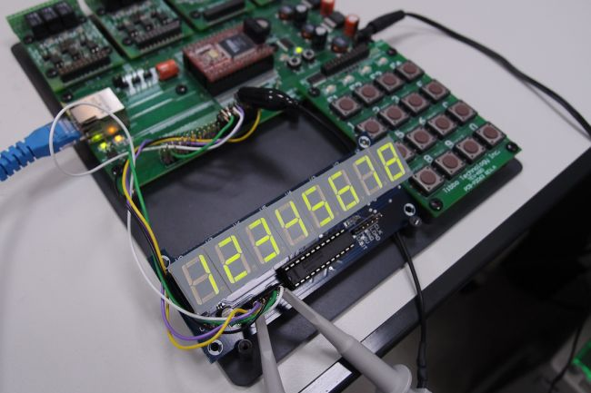

# Segment LED Display with SSI Object

This application shows how to use the [SSI object](http://blog.tibbo.com/post/274501425/ssi-object-is-ready) to communicate with a [MAX7219](http://datasheets.maxim-ic.com/en/ds/MAX7219-MAX7221.pdf) IC driving an 8-digit LED display.

The line mapping is as follows:

- Load: GPIO 46
- Clock: GPIO 47
- Din: GPIO 48

**Important note:** To use this application, you must read the MAX7219 [manual](http://datasheets.maxim-ic.com/en/ds/MAX7219-MAX7221.pdf). It may not work otherwise, as the display has several modes of operation.

## What It Looks Like

This is what the project looked like on our bench:

